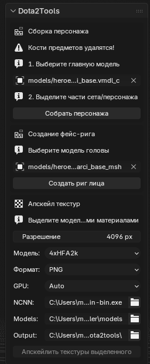
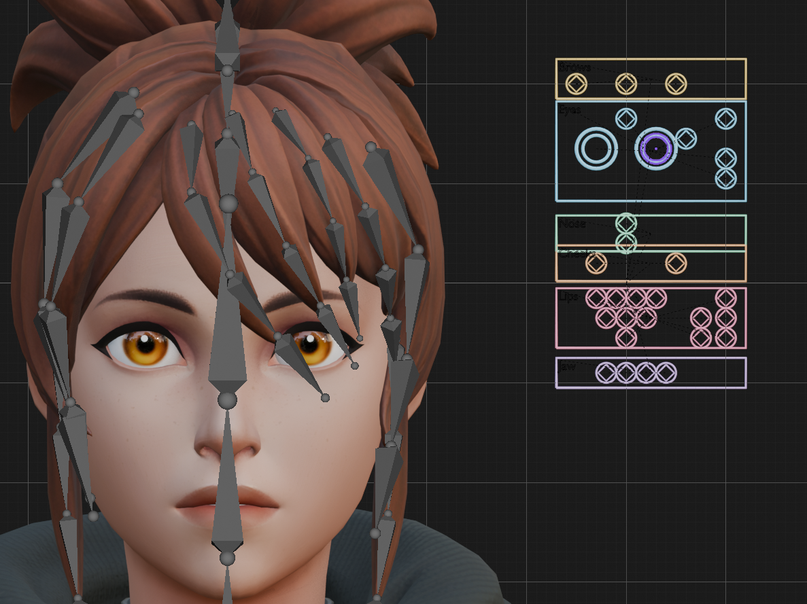
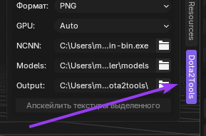

# Dota 2 Face Rig Creator

_Blender Version: 4.2.3_

_Addon Version: 0.3_

# Установка аддона 💾

1. Скачайте архив аддона.
2. Установите аддон в Blender: `Preferences -> Add-ons -> Install From Disk...`.
3. Включите аддон.
4. Откройте панель справа во `View3D`: вкладка `Dota2Tools`.

# Функции

## Сборка персонажа ⚙️

1. Выберите главную модель/скелет персонажа в поле аддона.
2. Выделите части сета или персонажа.
3. Нажмите `Собрать персонажа`.

Аддон объединяет выбранные armature в основной скелет и удаляет дубли костей вида `.001`, `.002` и т.п., если такая кость уже есть в основной модели. Mesh-объекты перепривязываются к главному armature.

## Создание фейс-рига 🙂

1. Выберите модель головы со Shape Keys.
2. Нажмите `Создать риг лица`.
3. Переместите созданный фейс-риг в удобное место.

## Апскейл текстур ⬆️

1. Выделите модели, у которых нужно апскейлить текстуры.
2. В блоке `Апскейл текстур` выберите размер длинной стороны, модель апскейла, формат и GPU.
3. Проверьте пути `NCNN`, `Models` и `Output`.
4. Нажмите `Апскейлить текстуры выделенного`.

⚠️ Важно: апскейл текстур использует внешние ncnn-модели и может сильно нагружать CPU/GPU/RAM/VRAM. Используйте на свой страх и риск, особенно на больших текстурах или большом количестве материалов: Blender может зависнуть или закрыться, если системе не хватит ресурсов.

# Ссылки

- Texture Upscaler: https://github.com/haseebahmed295/Texture_Upscaler
- Fuse Skeletons: https://github.com/AnimNyan/Fuse-Skeletons

# Статус

Аддон находится в разработке, могут быть баги.

О багах и предложениях пишите в Telegram: `@sufferedkid`.
